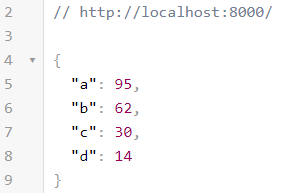

# random-poll

Import this to run a local server that outputs 4 random numbers in JSON format

# Getting Started

## Installation

In the terminal type:

1. `npm init -y`
1. `npm i random-poll`

## Quick Start

To start a local server on port 8000 type:

1. `npm start`
1. Then if you go to localhost:8000 you will see an object with 4 random numbers:
   
1. Now you can fetch from that url

```js
fetch("http://localhost:8000")
  .then((res) => res.json())
  .then((data) => console.log(data));
```

# Source Code

```js
const http = require("http");
const PORT = 8000;

function getRandom(max) {
  return Math.floor(Math.random() * Math.floor(max));
}

function getNumbers() {
  const MAX = 100;
  const numbers = {
    a: getRandom(MAX),
    b: getRandom(MAX),
    c: getRandom(MAX),
    d: getRandom(MAX),
  };
  return numbers;
}

const requestListener = function (req, res) {
  res.setHeader("Access-Control-Allow-Origin", "*");
  res.writeHead(200);
  res.end(JSON.stringify(getNumbers()));
};

const server = http.createServer(requestListener);
console.log(`listening on port ${PORT}`);
server.listen(PORT);
```
